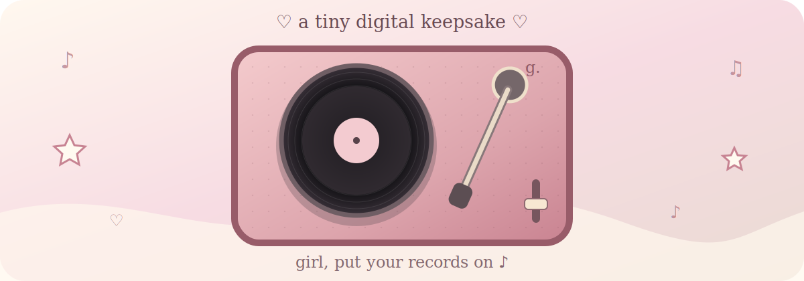
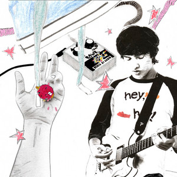
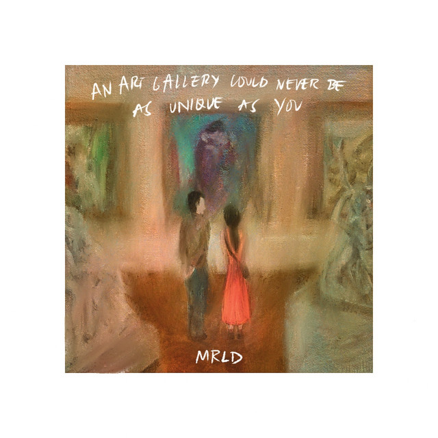
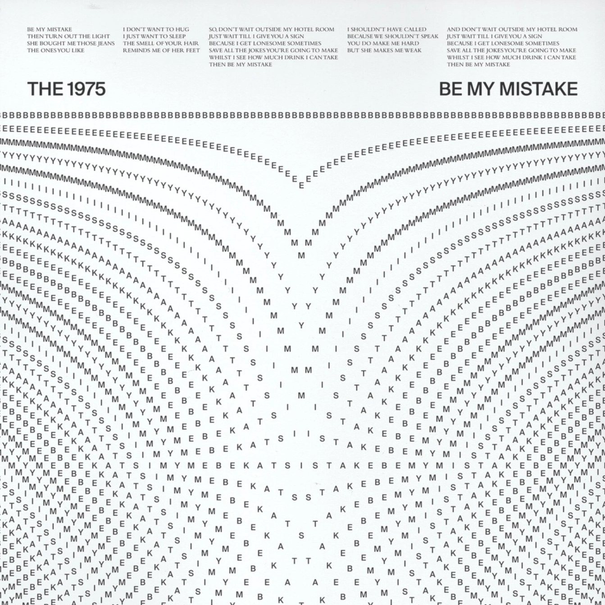
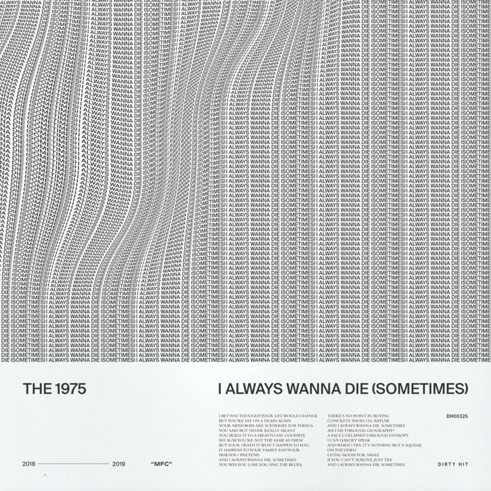
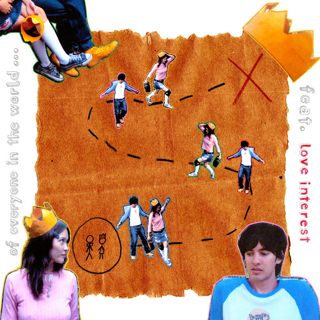

<div align="center">



# ♡ Gwyn's Little Record Player ♡

### `girl, put your records on ♪`

*A tiny interactive vinyl shelf made as a digital keepsake—best enjoyed slowly, with headphones.*

`Vite` · `TypeScript` · `Web Audio` · `GitHub Pages`

₊˚⊹ 𐙚 **eight records · handwritten notes · one very special listener** 𐙚 ⊹˚₊

</div>

---

## The little keepsake

This is more than a playlist dressed like a record player. Every sleeve can be opened, every vinyl can be physically pulled out and placed on the platter, and the tonearm actually starts and pauses the music.

Inside are eight individually styled records, synchronized handwritten lyrics, timed lighting moments, hidden paper notes, procedural physical sound effects, manual vinyl scratching, and a gift-box introduction.

Nothing needs a server. Everything runs as a static website.

<div align="center">

### ✦ the eight-piece shelf ✦

<table>
  <tr>
    <td></td>
    <td></td>
    <td></td>
    <td></td>
  </tr>
  <tr>
    <td align="center"><sub>01</sub></td>
    <td align="center"><sub>02</sub></td>
    <td align="center"><sub>03</sub></td>
    <td align="center"><sub>04</sub></td>
  </tr>
  <tr>
    <td></td>
    <td></td>
    <td></td>
    <td></td>
  </tr>
  <tr>
    <td align="center"><sub>05</sub></td>
    <td align="center"><sub>06</sub></td>
    <td align="center"><sub>07</sub></td>
    <td align="center"><sub>08</sub></td>
  </tr>
</table>

*pick a sleeve, pull out the vinyl, and let the needle find the rest*

</div>

## Things to try

- Tap a sleeve to slide it open.
- Drag the vinyl onto the platter—or tap it and let it glide there.
- Move the tonearm onto the record to begin playing.
- Spin the black grooves manually to seek forward or backward.
- Drag the center label to return a record to its sleeve.
- Double-tap a sleeve to swap records automatically.
- Turn the tiny volume slider and listen for its tactile clicks.
- Keep an eye out for something that may fall from a sleeve.

## Spin it locally

You need a current version of [Node.js](https://nodejs.org/).

```powershell
npm install
npm run dev
```

Open the local address printed by Vite. To check the production version:

```powershell
npm test
npm run build
npm run preview
```

## Fill the shelf

All record-specific content lives in `src/records.ts`. Each entry controls its title, artist, sleeve text, center-label text, colors, artwork, song, lighting timeline, hidden note, and optional synchronized lyrics.

| Piece | Location |
|---|---|
| Songs | `public/audio/record-01.mp3` through `record-08.mp3` |
| Album sleeves | `public/art/sleeve-01.webp` through `sleeve-08.webp` |
| Optional vinyl artwork | `public/art/vinyl-01.webp` through `vinyl-08.webp` |
| Base sticker overlay | `public/art/base-stickers.png` |
| Record configuration | `src/records.ts` |
| Sound-effect levels | `src/sfx.ts` |

Square sleeve artwork around `1000 × 1000` or `1200 × 1200` works best. Missing artwork gracefully falls back to the player’s built-in CSS vinyl design.

### Vinyl center controls

The global switches are near the top of `src/records.ts`:

```ts
export const USE_SLEEVE_ART_ON_VINYL_LABEL = true;
export const SHOW_VINYL_LABEL_TEXT = true;
```

A single record can override either choice:

```ts
vinylLabel: {
  useSleeveArt: false,
  showText: false,
},
```

## Tiny sounds, no sound files

Sleeve rustles, paper movement, vinyl handling, tonearm mechanics, platter taps, volume clicks, runout crackle, and the unboxing chime are synthesized in the browser with Web Audio.

Adjust the master level or individual effects through `SFX_LEVELS` in `src/sfx.ts`.

## Publish on GitHub Pages

The repository already includes the deployment workflow.

1. Create a public GitHub repository named `gwyn-record-player`.
2. Push this project to its `main` branch.
3. Open **Settings → Pages**.
4. Set **Source** to **GitHub Actions**.
5. Let the included **Deploy to GitHub Pages** workflow finish.
6. Visit `https://YOUR-USERNAME.github.io/gwyn-record-player/`.

If the repository gets a different name, update the production `base` path in `vite.config.ts`.

> [!NOTE]
> GitHub Pages and public repositories make included audio files publicly reachable. Only publish music you have permission to distribute.

---

<div align="center">

*made with care & played at 33⅓-ish*

♡　♪　♡

</div>
